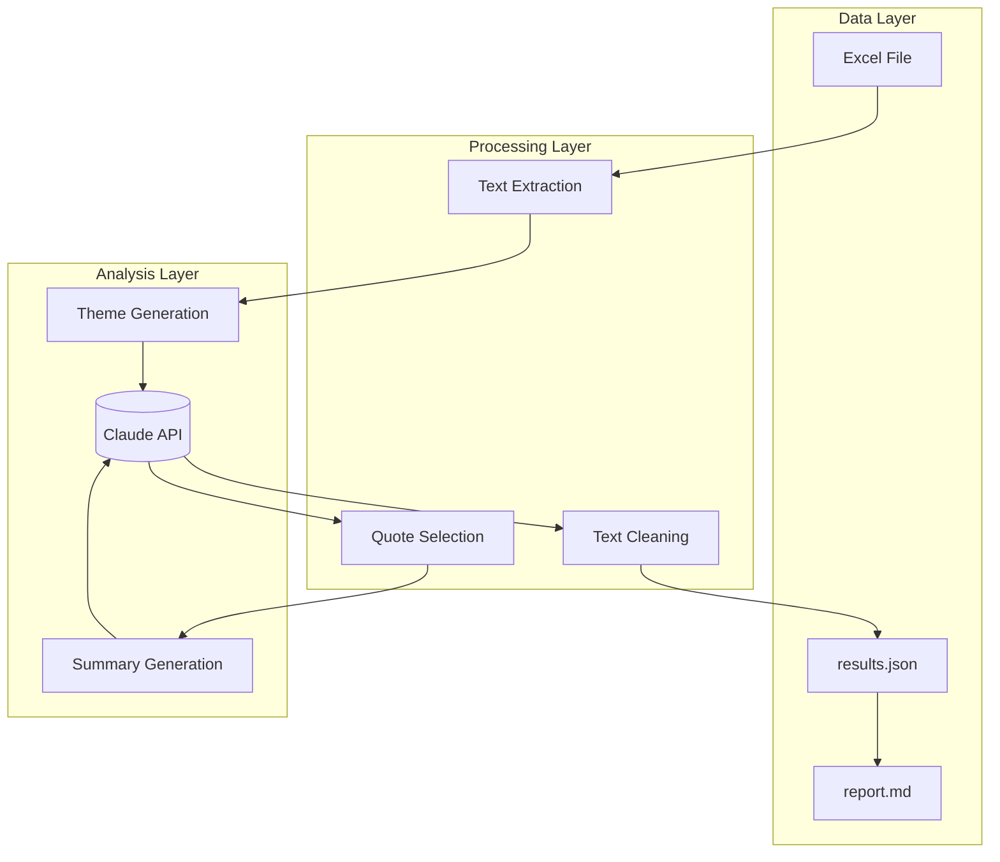

# Thematic Analysis Pipeline

Turns survey responses into clean, themed insights using Claude.

## Architecture



## What It Does

- Reads survey responses from Excel
- Groups responses into 3 themes per question
- Picks representative quotes (no duplicates)
- Writes executive summaries
- Outputs JSON and Markdown

## Features

| Feature | Description |
|---------|-------------|
| Varied Metrics | Uses ratios, rankings, comparisons (not just percentages) |
| Varied Openings | Sentences start differently, not always "Participants..." |
| Unique Quotes | No quote appears twice across themes |
| Deterministic | Temperature=0 for reproducible results |

## Setup

```bash
pip install -r requirements.txt
export ANTHROPIC_API_KEY="your-key"
```

## Usage

```bash
# Run analysis
python src/pipeline.py data.xlsx output/results.json

# Generate report
python src/report.py output/results.json output/report.md
```

## Project Structure

```
usercue-thematic-analysis/
├── src/
│   ├── __init__.py
│   ├── pipeline.py        # Main analysis
│   └── report.py          # Report generator
├── tests/
│   ├── __init__.py
│   └── test_pipeline.py   # Unit tests
├── docs/
│   ├── ARCHITECTURE.md
│   └── USAGE.md
├── output/
│   ├── results.json
│   └── report.md
├── requirements.txt
└── README.md
```

## Output Format

```json
{
  "question_key": {
    "question": "The question text",
    "n_participants": 105,
    "headline": "Key insight under 12 words",
    "summary": "Two sentences with theme percentages",
    "themes": [
      {
        "title": "Theme title",
        "description": "4-5 sentences with varied metrics",
        "pct": 38,
        "quotes": [
          {"participant_id": "4434", "quote": "What they said"}
        ]
      }
    ]
  }
}
```

## Example Theme

**Privacy and Security Focus** (37%)

Privacy concerns dominate VPN selection criteria, with no-logs policies ranking as the top priority among participants. Identity protection and data encryption emerge as core requirements, while participants frequently mention protection from hackers and tracking. Strong preference exists for anonymous browsing capabilities and IP address masking. This segment represents premium customers willing to invest in verified privacy solutions.

## Tests

```bash
pytest tests/ -v
```

## Docs

- [Architecture](docs/ARCHITECTURE.md)
- [Usage Guide](docs/USAGE.md)
