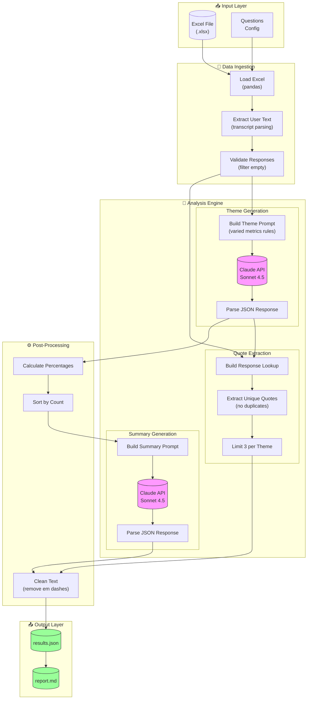

# Thematic Analysis Pipeline

LLM-powered thematic analysis for qualitative research using Claude API.

## System Architecture



## Features

| Feature | Description |
|---------|-------------|
| **3 Themes per Question** | Consistent structure across all analyses |
| **Varied Metrics** | Ratios, rankings, qualitative (max 1% per theme) |
| **Varied Openings** | "Privacy dominates...", "Strong preference exists..." |
| **Unique Quotes** | No duplicates across themes |
| **Deterministic** | Temperature=0 for reproducible results |

## Setup

```bash
pip install -r requirements.txt
export ANTHROPIC_API_KEY="your-key"
```

## Usage

```bash
# Run analysis
python src/pipeline.py data.xlsx output/results.json

# Generate report
python src/report.py output/results.json output/report.md
```

## Project Structure

```
usercue-thematic-analysis/
├── src/
│   ├── __init__.py
│   ├── pipeline.py        # Main analysis
│   └── report.py          # Report generator
├── tests/
│   ├── __init__.py
│   └── test_pipeline.py   # Unit tests
├── docs/
│   ├── ARCHITECTURE.md
│   └── USAGE.md
├── output/
│   ├── results.json
│   └── report.md
├── .gitignore
├── requirements.txt
└── README.md
```

## Output Format

```json
{
  "question_key": {
    "question": "The question text",
    "n_participants": 105,
    "headline": "Key insight under 12 words",
    "summary": "Two sentences with theme percentages",
    "themes": [
      {
        "title": "Theme title",
        "description": "4-5 sentences with varied metrics",
        "pct": 38,
        "quotes": [
          {"participant_id": "4434", "quote": "What they said"}
        ]
      }
    ]
  }
}
```

## Configuration

| Setting | Value |
|---------|-------|
| Model | claude-sonnet-4-5-20250929 |
| Temperature | 0 |
| Max Tokens | 4096 |

## Example Output

**Privacy and Security Focus** (37%)

Privacy concerns dominate VPN selection criteria, with no-logs policies ranking as the top priority among participants. Identity protection and data encryption emerge as core requirements, while participants frequently mention protection from hackers and tracking. Strong preference exists for anonymous browsing capabilities and IP address masking. This segment represents premium customers willing to invest in verified privacy solutions.

## Tests

```bash
pytest tests/ -v
```

## Docs

- [Architecture](docs/ARCHITECTURE.md)
- [Usage Guide](docs/USAGE.md)
