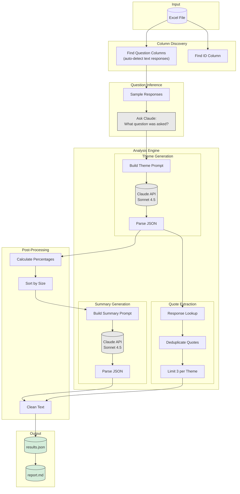

# Thematic Analysis Pipeline

Turns survey responses into organized themes using Claude. Drop in an Excel file, get back grouped insights with supporting quotes.

## How It Works



## What It Does

- Reads any Excel file with survey responses
- Auto-detects which columns are questions
- Infers the actual question text from responses (not just column names)
- Groups responses into 3 themes per question
- Picks representative quotes without duplicates
- Writes executive summaries
- Outputs JSON and Markdown

## Features

| Feature | Description |
|---------|-------------|
| Question Inference | Figures out what was asked by looking at responses |
| Dynamic Columns | Extracts question columns automatically from your Excel |
| Varied Metrics | Uses ratios, rankings, comparisons (not just percentages) |
| Varied Openings | Sentences start differently, not always "Participants..." |
| Unique Quotes | No quote appears twice across themes |
| Deterministic | Temperature=0 for reproducible results |

## Setup

```bash
pip install -r requirements.txt
export ANTHROPIC_API_KEY="your-key"
```

## Usage

```bash
# Run analysis on any Excel file
python src/pipeline.py survey_data.xlsx output/results.json

# Generate markdown report
python src/report.py output/results.json output/report.md
```

The pipeline will automatically find:
- The ID column (looks for "id", "participant_id", etc.)
- Question columns (any column with text responses longer than 20 chars average)
- The actual question text (inferred from how people responded)

### Question Inference Example

Instead of guessing from column names like `vpn_selection`, the pipeline samples responses and asks Claude what question was likely asked:

| Column | Inferred Question |
|--------|-------------------|
| vpn_selection | What factors were most important when selecting your VPN? |
| current_vpn_feedback | What features do you wish your VPN had? |
| remove_data_steps_probe_no | Would you be interested in removing your personal information from online databases? |

## Project Structure

```
usercue-thematic-analysis/
├── src/
│   ├── __init__.py
│   ├── pipeline.py        # Main analysis
│   └── report.py          # Report generator
├── tests/
│   ├── __init__.py
│   └── test_pipeline.py   # Unit tests
├── docs/
│   ├── ARCHITECTURE.md
│   └── USAGE.md
├── output/
│   ├── results.json
│   └── report.md
├── .gitignore
├── requirements.txt
└── README.md
```

## Output Format

```json
{
  "column_name": {
    "question": "What are your thoughts on column name?",
    "n_participants": 105,
    "headline": "Key insight under 12 words",
    "summary": "Two sentences with theme percentages",
    "themes": [
      {
        "title": "Theme title",
        "description": "4-5 sentences with varied metrics",
        "pct": 38,
        "quotes": [
          {"participant_id": "4434", "quote": "What they said"}
        ]
      }
    ]
  }
}
```

## Configuration

| Setting | Value |
|---------|-------|
| Model | claude-sonnet-4-5-20250929 |
| Temperature | 0 |
| Max Tokens | 4096 |

## Example Output

**Privacy and Security Focus** (37%)

Privacy concerns dominate selection criteria, with no-logs policies ranking as the top priority. Encryption strength matters more than server count for this segment. Strong preference exists for transparent security certifications, and most participants specifically mention identity protection. This represents premium customers willing to pay for verified privacy.

## Tests

```bash
pytest tests/ -v
```

## Docs

- [Architecture](docs/ARCHITECTURE.md)
- [Usage Guide](docs/USAGE.md)
