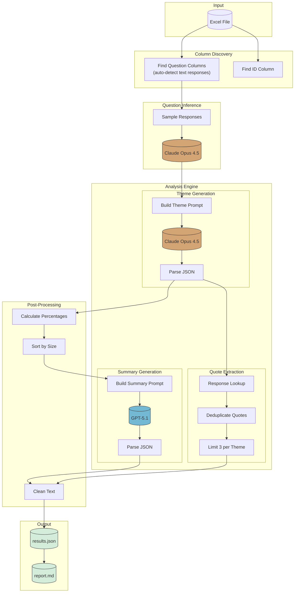

# Production Thematic Research Analysis Agent

**Turn messy survey responses into clean research insights-automatically.**

Drop in an Excel file, get back organized themes with quotes and executive summaries. Uses Claude Opus 4.5 to find patterns and GPT-5.1 to write the summaries.

## Overview

Manual coding takes forever. This pipeline reads your survey responses, figures out what questions were asked, groups similar answers into themes, and picks the best quotes to back them up. What used to take a research team hours now runs in minutes.

What's inside:

- Auto-detects questions from how people responded (not just column names)
- Finds 3-5 natural themes per question based on semantic clustering
- Picks quotes that actually support each theme (model selects best matches)
- No duplicate quotes across themes (tracked globally)
- Outputs JSON for your tools + Markdown for humans

### Why Two Models?

Claude Opus 4.5 handles the heavy lifting-parsing transcripts, assigning participants to themes, selecting quote IDs. It's precise and follows structured output formats well. GPT-5.1 writes the headlines and summaries with a warmer, more executive tone. Each model does what it's best at.

### Temperature Settings

Different tasks need different creativity levels:

| Task | Model | Temp | Why |
|------|-------|------|-----|
| Question inference | Claude | 0.3 | Natural phrasing without hallucination |
| Theme extraction | Claude | 0.1 | Near-deterministic for accurate IDs |
| Summary generation | GPT | 0.5 | Varied, natural executive language |

## How It Works



## What It Does

- Reads any Excel file with survey responses
- Auto-detects which columns are questions
- Infers the actual question text from responses (not just column names)
- Groups responses into 3-5 themes per question (based on natural clustering)
- Picks representative quotes without duplicates
- Writes executive summaries
- Outputs JSON and Markdown

## Features

| Feature | Description |
|---------|-------------|
| Dual Model | Claude Opus 4.5 for extraction, GPT-5.1 for summaries |
| Question Inference | Figures out what was asked by looking at responses |
| Dynamic Columns | Extracts question columns automatically from your Excel |
| Variable Themes | 3-5 themes based on natural clustering in the data |
| Senior Research Tone | Authoritative, $500/hour consultant voice |
| Varied Metrics | Uses ratios, rankings, comparisons (not just percentages) |
| Varied Openings | Sentences start differently, not always "Participants..." |
| Unique Quotes | No quote appears twice across themes |

## Setup

```bash
pip install -r requirements.txt
export ANTHROPIC_API_KEY="your-key"
export OPENAI_API_KEY="your-key"
```

## Usage

```bash
# Run analysis on any Excel file
python src/pipeline.py survey_data.xlsx output/results.json

# Generate markdown report
python src/report.py output/results.json output/report.md
```

The pipeline will automatically find:
- The ID column (looks for "id", "participant_id", etc.)
- Question columns (any column with text responses longer than 20 chars average)
- The actual question text (inferred from how people responded)

### Question Inference Example

Instead of guessing from column names like `vpn_selection`, the pipeline samples responses and asks Claude what question was likely asked:

| Column | Inferred Question |
|--------|-------------------|
| vpn_selection | What factors were most important when selecting your VPN? |
| current_vpn_feedback | What features do you wish your VPN had? |
| remove_data_steps_probe_no | Would you be interested in removing your personal information from online databases? |

## Project Structure

```
usercue-thematic-analysis/
├── src/
│   ├── __init__.py
│   ├── pipeline.py        # Main analysis
│   └── report.py          # Report generator
├── tests/
│   ├── __init__.py
│   └── test_pipeline.py   # Unit tests
├── docs/
│   ├── ARCHITECTURE.md
│   └── USAGE.md
├── output/
│   ├── results.json
│   └── report.md
├── .gitignore
├── requirements.txt
└── README.md
```

## Output Format

```json
{
  "column_name": {
    "question": "What factors influenced your decision when choosing your VPN?",
    "n_participants": 105,
    "headline": "Key insight under 8 words",
    "summary": "1-2 sentences with actionable recommendation",
    "themes": [
      {
        "title": "Theme title",
        "description": "3-4 sentences. Senior researcher voice.",
        "pct": 38,
        "quotes": [
          {"participant_id": "4434", "quote": "What they said"}
        ]
      }
    ]
  }
}
```

## Configuration

| Setting | Value | Purpose |
|---------|-------|---------|
| Claude Model | claude-opus-4-5-20251101 | Theme extraction |
| GPT Model | gpt-5.1 | Summary generation |
| Extraction Temp | 0.1 | Near-deterministic themes |
| Summary Temp | 0.5 | Natural language variation |
| Inference Temp | 0.3 | Natural question phrasing |

## Example Output

**Privacy and Security Focus** (37%)

Privacy concerns dominate selection criteria, with no-logs policies ranking as the top priority. Encryption strength matters more than server count for this segment. Strong preference exists for transparent security certifications, and most participants specifically mention identity protection. This represents premium customers willing to pay for verified privacy.

## Tests

```bash
pytest tests/ -v
```

## Docs

- [Architecture](docs/ARCHITECTURE.md)
- [Usage Guide](docs/USAGE.md)
